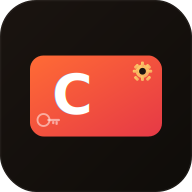

<div align="center">
  

  <h1>Carsai YT Studio</h1>

  <p>
    <strong>🇧🇷 Plataforma completa para criadores YouTube com IA integrada</strong><br/>
    <strong>🇺🇸 Complete YouTube creator platform with integrated AI</strong><br/>
    <strong>🇪🇸 Plataforma completa para creadores de YouTube con IA integrada</strong>
  </p>

  <p>
    <a href="https://github.com/carsaimz/carsai-yt-studio/actions/workflows/web.yml">
      
    </a>
    <a href="https://github.com/carsaimz/carsai-yt-studio/actions/workflows/android.yml">
      
    </a>
    <a href="https://github.com/carsaimz/carsai-yt-studio/actions/workflows/desktop.yml">
      
    </a>
    
    
    
  </p>

  <p>
    <a href="#português">🇧🇷 Português</a> •
    <a href="#english">🇺🇸 English</a> •
    <a href="#español">🇪🇸 Español</a>
  </p>
</div>

---

## <a id="português"></a>🇧🇷 Português

### O que é?

Carsai YT Studio é uma alternativa ao YouTube Studio com superpoderes de IA. Gere o seu canal, analise métricas, responda comentários, faça uploads e muito mais — tudo numa só aplicação que funciona no browser, Android e desktop.

### Funcionalidades

| | Funcionalidade | Descrição |
|--|---|---|
| 📊 | **Analytics avançada** | Views, likes, retenção e watch time — dados reais da YouTube API |
| 🎬 | **Gestão de conteúdo** | Upload de vídeos, edição de metadados, thumbnails, playlists |
| 💬 | **Comunidade** | Responder, editar, moderar e eliminar comentários em tempo real |
| 🔍 | **SEO** | Tags reais do canal, pesquisa de concorrentes, optimizador de títulos |
| 🤖 | **IA & Agentes** | Chat, roteiros, thumbnails — Gemini, Groq, OpenAI, Claude e mais |
| 🎨 | **Estúdio** | Editor de vídeo, analytics detalhada, branding do canal |
| 🌍 | **Multi-idioma** | Português, English, Español |
| 📱 | **Multi-plataforma** | Web, Android, Windows, macOS, Linux |

### Início Rápido

```bash
git clone https://github.com/carsaimz/carsai-yt-studio.git
cd carsai-yt-studio
npm install
cp .env.example .env
# Preencher .env com chaves Firebase
npm run dev
```

> ⚠️ **Importante:** Adicione o seu domínio em Firebase Console → Authentication → Authorized domains.

### Tecnologias

React 19 · TanStack Start · Vite · Tailwind CSS v4 · Firebase · YouTube Data API v3 · Capacitor · Tauri v2

### Download

| Plataforma | Link |
|---|---|
| 🌐 Web | [carsai-yt-studio.vercel.app](https://carsai-yt-studio.vercel.app) |
| 📱 Android APK | [Releases](https://github.com/carsaimz/carsai-yt-studio/releases/latest) |
| 🖥️ Desktop | [Releases](https://github.com/carsaimz/carsai-yt-studio/releases/latest) |

### Contribuir

Leia [CONTRIBUTING.md](CONTRIBUTING.md) e [CODE_OF_CONDUCT.md](CODE_OF_CONDUCT.md).

---

## <a id="english"></a>🇺🇸 English

### What is it?

Carsai YT Studio is a YouTube Studio alternative with AI superpowers. Manage your channel, analyze metrics, reply to comments, upload videos and much more — all in one app that works on browser, Android and desktop.

### Features

| | Feature | Description |
|--|---|---|
| 📊 | **Advanced Analytics** | Views, likes, retention and watch time — real YouTube API data |
| 🎬 | **Content Management** | Video upload, metadata editing, thumbnails, playlists |
| 💬 | **Community** | Reply, edit, moderate and delete comments in real time |
| 🔍 | **SEO** | Real channel tags, competitor search, title optimizer |
| 🤖 | **AI & Agents** | Chat, scripts, thumbnails — Gemini, Groq, OpenAI, Claude and more |
| 🎨 | **Studio** | Video editor, detailed analytics, channel branding |
| 🌍 | **Multi-language** | Portuguese, English, Spanish |
| 📱 | **Multi-platform** | Web, Android, Windows, macOS, Linux |

### Quick Start

```bash
git clone https://github.com/carsaimz/carsai-yt-studio.git
cd carsai-yt-studio
npm install
cp .env.example .env
# Fill .env with Firebase keys
npm run dev
```

> ⚠️ **Important:** Add your domain in Firebase Console → Authentication → Authorized domains.

### Tech Stack

React 19 · TanStack Start · Vite · Tailwind CSS v4 · Firebase · YouTube Data API v3 · Capacitor · Tauri v2

### Environment Variables

```env
VITE_FIREBASE_API_KEY=
VITE_FIREBASE_AUTH_DOMAIN=
VITE_FIREBASE_PROJECT_ID=
VITE_FIREBASE_STORAGE_BUCKET=
VITE_FIREBASE_MESSAGING_SENDER_ID=
VITE_FIREBASE_APP_ID=
VITE_FIREBASE_MEASUREMENT_ID=
VITE_YOUTUBE_API_KEY=
```

### Contributing

Read [CONTRIBUTING.md](CONTRIBUTING.md) and [CODE_OF_CONDUCT.md](CODE_OF_CONDUCT.md).

### License

MIT © [carsaimz](https://github.com/carsaimz)

---

## <a id="español"></a>🇪🇸 Español

### ¿Qué es?

Carsai YT Studio es una alternativa a YouTube Studio con superpoderes de IA. Gestiona tu canal, analiza métricas, responde comentarios, sube vídeos y mucho más — todo en una sola aplicación que funciona en el navegador, Android y escritorio.

### Funcionalidades

| | Funcionalidad | Descripción |
|--|---|---|
| 📊 | **Analytics avanzada** | Datos reales de la YouTube API |
| 🎬 | **Gestión de contenido** | Subida de vídeos, edición de metadatos, miniaturas, listas |
| 💬 | **Comunidad** | Responder, editar, moderar y eliminar comentarios |
| 🔍 | **SEO** | Etiquetas reales, búsqueda de competidores |
| 🤖 | **IA & Agentes** | Chat, guiones — Gemini, Groq, OpenAI, Claude y más |

### Inicio Rápido

```bash
git clone https://github.com/carsaimz/carsai-yt-studio.git
cd carsai-yt-studio
npm install
cp .env.example .env
npm run dev
```

### Contribuir

Lee [CONTRIBUTING.md](CONTRIBUTING.md) y [CODE_OF_CONDUCT.md](CODE_OF_CONDUCT.md).

### Licencia

MIT © [carsaimz](https://github.com/carsaimz)

---

<div align="center">
  <sub>Built with ❤️ by <a href="https://github.com/carsaimz">carsaimz</a></sub>
</div>
